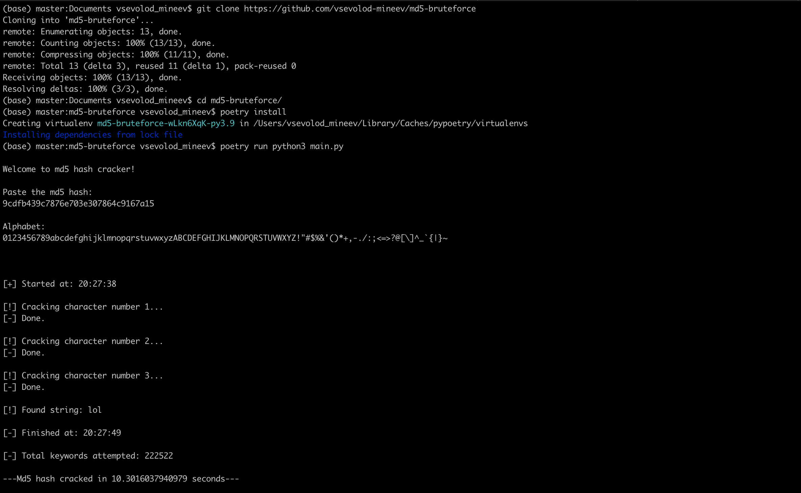

# Script to brute force an md5 hash.

This script is for brute forcing your way through an md5 hash. Clone the repo, install the dependencies, run the script, paste your hash -> done.

# How to use:
In order to use this script you must first install `poetry`.

To install `poetry` on osx or linux use:
```
curl -sSL https://raw.githubusercontent.com/python-poetry/poetry/master/get-poetry.py | python -
```
To install `poetry` on windows powershell use:
```
(Invoke-WebRequest -Uri https://raw.githubusercontent.com/python-poetry/poetry/master/get-poetry.py -UseBasicParsing).Content | python -
```
Clone this Github repository into your current directory before changing into it:
```
git clone https://github.com/vsevolod-mineev/md5-bruteforce
```
```
cd md5-brute-force/
```
To install the defined dependencies for this project use:
```
poetry install
```
To execute the command within the virtual environment use:
```
poetry run
```

Run the script using the following format:
```
poetry run python3 main.py
```

# How does it work?


